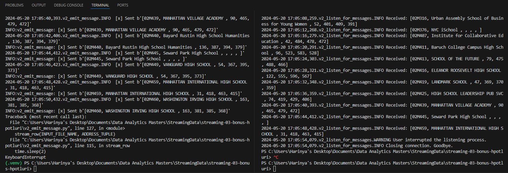

# streaming-03-bonus-hpotluri

Harinya Potluri 05/20/2024

[Link to Data](https://data.cityofnewyork.us/Education/SAT-College-Board-2010-School-Level-Results/zt9s-n5aj/about_data)

## Optionnal Bonus -- Question 6

I used the data from the last assignment. I found this data by looking up data and this one had less data entries and sounded interesting. For the producer, I ended up combining the last homework's and homework's three v2 emit message. What happens is when stream row is called instead of using sockets it will emit the message to my RabbitMQ. The rest of the code is kept the same as homework two, such as processing the data from the CSV. For the consumer, I did the same as the producer. I took parts from homework two and added it too v2 listen for message. The main difference is that I added a bit of code inside processed message to also write down the message recieved to an output file on top of printing out said message. 

